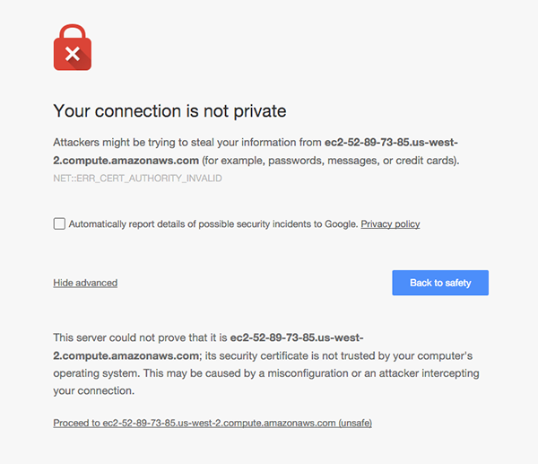
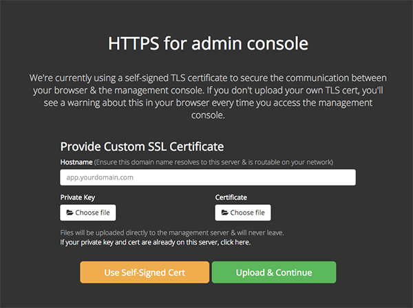
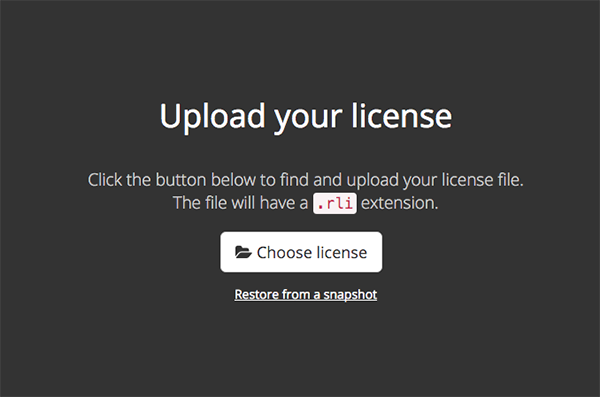
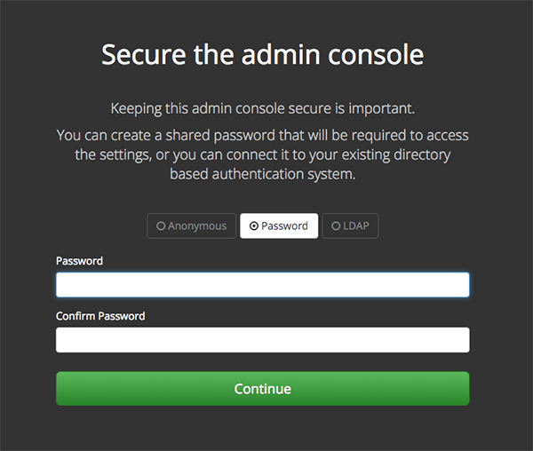
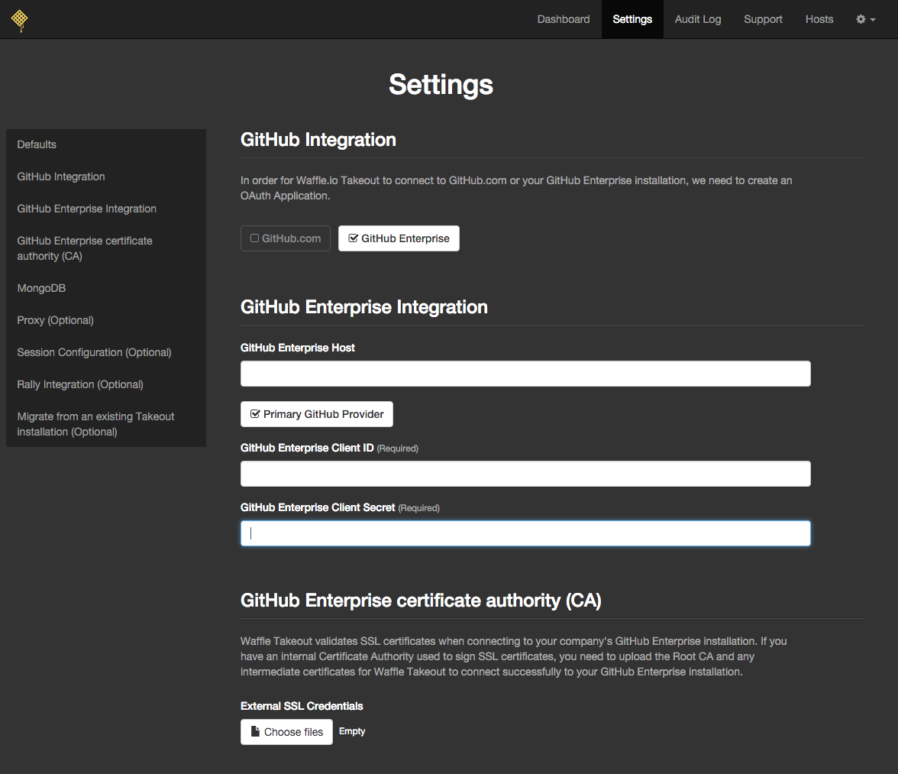
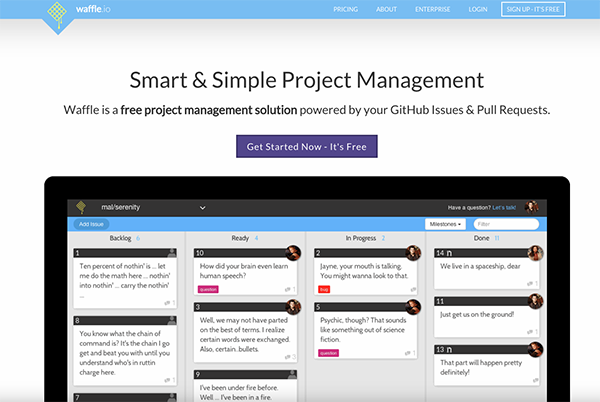

# Installing Waffle Takeout

Please submit a request on [https://takeout.waffle.io](https://takeout.waffle.io) for more information on pricing and to register for a 45 day trial.

Getting Started guides and other Waffle.io documentation can be found [here](https://github.com/waffleio/waffle.io/wiki).

# Prerequisites

* A supported Linux server (modern versions of Ubuntu, Debian, CentOS, Red Hat & Fedora)
* A Waffle Takeout license file (downloadable from [https://takeout.waffle.io](https://takeout.waffle.io))
* A GitHub Enterprise installation secured via SSL certificate. (Waffle Takeout does not support connecting to GitHub Enterprise insecurely over HTTP at this time.)
* A MongoDB instance. Waffle does not currently ship with our own database and we require you to manage your database.
  * You will need to create a db in MongoDB for Waffle Takeout
  * If you are using authentication, you will need to create a user/password in MongoDB which has read/write privileges on the created DB and then set the MongoDB connection string to `user:password@yourmongodb-host-name-or-ip:27017/dbname`

## Host Machine

The standard setup consists of one host.

If you are using EC2, we recommend the m4.large instance type with at least a 32GB EBS volume.

For other setups we recommend hosts with 8 gigs of RAM and 2 CPUs.

## Network Configuration

To run Waffle Takeout, you will need to ensure the following ports are open:

| Port          | Service       | Description                                                                      |
| :------------ |:--------------| :--------------------------------------------------------------------------------|
| 8800          | Custom TCP    | This port is to access the admin dashboard for your Waffle Takeout installation  |
| 9880          | Custom TCP    | This port is for replicated host api to update the admin dashboard's status      |
| 443           | HTTPS         | Web application over HTTPS access                                                |
| 80            | HTTP          | Web application access                                                           |
| 22            | SSH           | SSH access                                                                       |

## Register a GitHub.com OAuth app

Waffle Takeout talks to GitHub Enterprise and GitHub.com via OAuth. You will need to create an OAuth application on your GitHub Enterprise installation or GitHub.com that Waffle Takeout can connect to.

#### For GitHub Enterprise

To register an OAuth application, first click on your profile icon. From there, navigate to Settings->Applications and to the Developer Applications tab. Select 'Register New Application.'

Make sure the Homepage URL and Authorization Callback match the URL for your Waffle Takeout installation.

When configuring your GitHub Enterprise url on the admin settings page, make sure to include the protocol ("https://") in the url.

## Installation

#### 1. SSH into your Linux server
#### 2. Run the following script:

 ```curl
$ curl -sSL https://get.replicated.com | sudo sh
 ```

#### 3. Access your server via HTTPS on port 8800 & bypass the SSL security warning.



#### 4. Upload a custom TLS/SSL cert/key or proceed with the provided self-signed pair.



#### 5. Upload the provided license file (.rli)



#### 6. Secure your Waffle Takeout Management console with a password



#### 7. Configure your Waffle Takeout instance and click "Save"



#### 8. Visit the hostname you provided to access Waffle Takeout



## Maintenance

### Updating your Waffle Takeout Installation

Update the Replicated agent on the host machine before upgrading the Waffle Takeout application. This is not always required, and the UI will prompt you to do so if it is required:

```curl
$ sudo apt-get update
$ sudo apt-get install replicated replicated-ui replicated-agent replicated-updater
```

You can check for new app releases by going to the management interface dashboard `https://waffle.company.com:8800` and clicking on the 'Check Now' button. If an update is available you will be able to read the release notes and install the update.

## Upgrading from 1.x (self-install) to 2.x

If you installed Waffle Takeout by downloading a set of docker images and then manually running an installation script to configure Waffle Takeout, you'll need to migrate to our new installation method.

Upgrading to the 2.x release only requires configuring the new installation with your existing database encryption keys. Follow the normal installation steps above, and then check the optional "Migrate" checkbox. Provide the "Encryption Key" and "Signing Key" from your existing installation. These are found in your `/etc/waffle/environment.list` file on your host machine.
